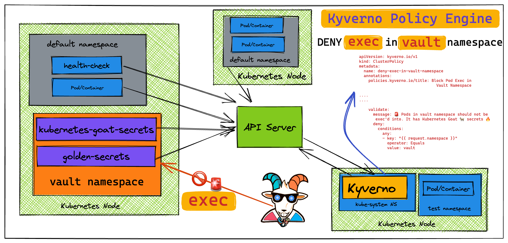

✅ 1. Install Kyverno using Helm (Recommended)
 Install Kyverno into the "kyverno" namespace
helm install kyverno kyverno/kyverno --namespace kyverno --create-namespace
"kyverno" has been added to your repositories
Hang tight while we grab the latest from your chart repositories...
...Successfully got an update from the "kyverno" chart repository
Update Complete. ⎈Happy Helming!⎈
NAME: kyverno
LAST DEPLOYED: Thu Jul 31 09:15:44 2025
NAMESPACE: kyverno
STATUS: deployed
REVISION: 1
NOTES:
Chart version: 3.4.4
Kyverno version: v1.14.4

Thank you for installing kyverno! Your release is named kyverno.

The following components have been installed in your cluster:
- CRDs
- Admission controller
- Reports controller
- Cleanup controller
- Background controller

⚠️  WARNING: Setting the admission controller replica count below 2 means Kyverno is not running in high availability mode.

⚠️  WARNING: PolicyExceptions are disabled by default. To enable them, set '--enablePolicyException' to true.

💡 Note: There is a trade-off when deciding which approach to take regarding Namespace exclusions. Please see the documentation at https://kyverno.io/docs/installation/#security-vs-operability to understand the risks.
controlplane:~$ 

ntrolplane:~$ kubectl get pods -n kyverno
NAME                                            READY   STATUS    RESTARTS   AGE
kyverno-admission-controller-68666f545d-gr4fh   1/1     Running   0          90s
kyverno-background-controller-5574bd864-9bfz6   1/1     Running   0          90s
kyverno-cleanup-controller-6fb8985659-h89fd     1/1     Running   0          90s
kyverno-reports-controller-6989f55fff-nlj9d     1/1     Running   0          90s

Test It Works (Optional)
Create a basic test policy:

yaml
Copy
Edit
# save as require-label.yaml
apiVersion: kyverno.io/v1
kind: ClusterPolicy
metadata:
  name: require-label
spec:
  validationFailureAction: enforce
  rules:
  - name: check-label
    match:
      resources:
        kinds:
        - Pod
    validate:
      message: "All pods must have the 'app' label."
      pattern:
        metadata:
          labels:
            app: "?*"
bash
Copy
Edit
kubectl apply -f require-label.yaml
Now try creating a pod without the app label—it will be rejected.
